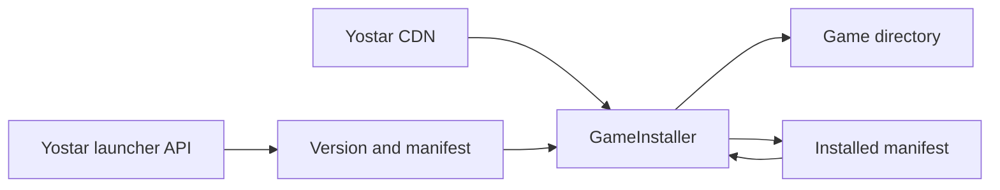
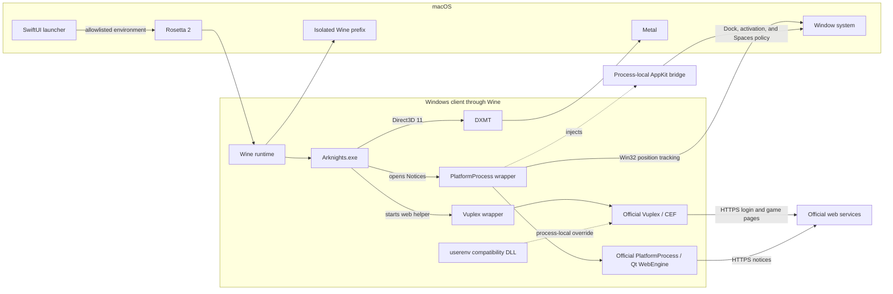
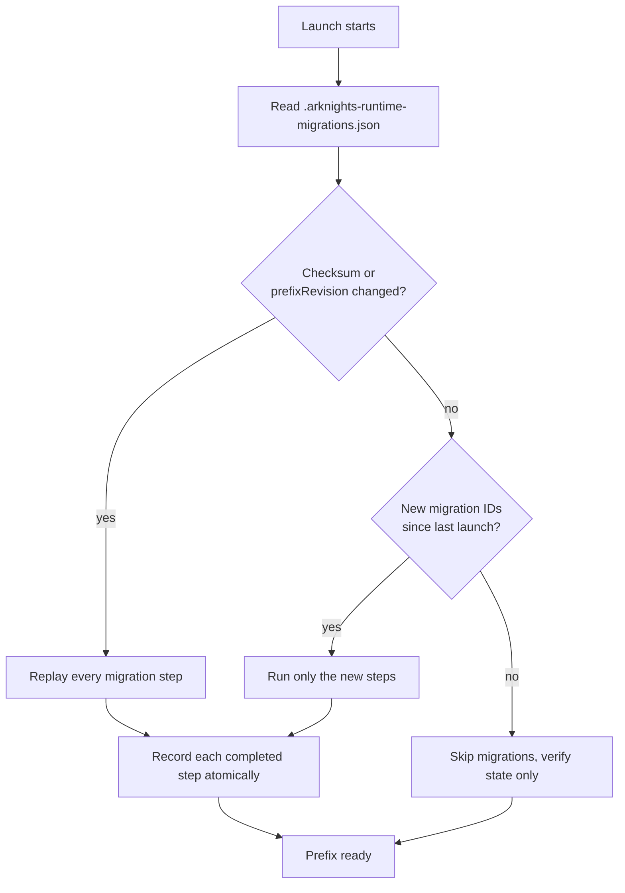
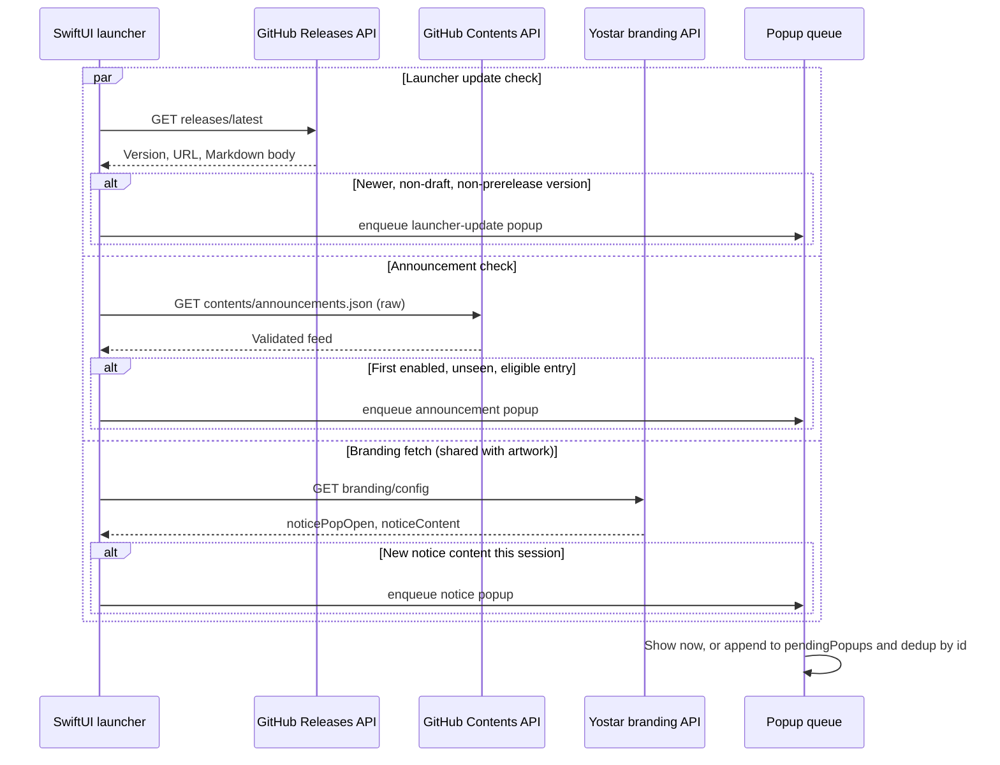

# Architecture

Arknights Client has a native SwiftUI launcher and a bundled Windows compatibility runtime. The launcher owns downloads, updates, settings, and process state. Wine is used only after **Play** is selected.

## Source layout

| Folder        | Responsibility                                                                                |
| ------------- | --------------------------------------------------------------------------------------------- |
| `Application` | App entry point and macOS lifecycle                                                           |
| `UI`          | Launcher, Settings, and document views                                                        |
| `ViewModels`  | UI state and user actions                                                                     |
| `Models`      | API payloads, install state, launch options, and errors                                       |
| `Services`    | Yostar API, artwork, installer, and launcher updates                                          |
| `Storage`     | Standard macOS paths and preferences                                                          |
| `Runtime`     | Wine environment, prefix configuration, DXMT, compatibility components, and process lifecycle |
| `Utilities`   | CRC64 and diagnostic logging                                                                  |

`LauncherViewModel` is the main UI orchestrator. Network access, installation, artwork caching, update discovery, announcements, and Wine execution remain separate service or runtime types; the view model coordinates their results into one user-facing `LauncherPhase`. Facts independent of that phase, such as whether game files are installed or a newer version exists, remain separate state.

## Installation

`LauncherAPI` obtains the current version, manifest, and CDN URLs for a `GameRegion` (Global, Japan, or Korea — same Yostar API shape and signature algorithm, different base URL and `game_tag`). `GameInstaller` validates every manifest path before writing, streams buffered network chunks into resumable `.part` files, verifies size and CRC64, and records the installed manifest.

A normal update compares the installed and current manifests so unchanged files can be reused. **Repair** deliberately skips that shortcut: it checks every installed file and downloads missing or damaged files again. Installation is exclusive; refreshes, Settings actions, and repeated clicks cannot start a second installer.

Each region has its own install directory and installed-state file, so regions install and update independently. They share one Wine prefix: `WinePrefixConfigurator` re-points the `G:` drive to the active region's directory on every launch, so a second prefix per region isn't needed.

## Launch process

The packaged runtime is x86_64 and runs through Rosetta 2. The launcher gives Wine an isolated prefix and an allowlisted environment, mounts the game directory as `G:`, installs the pinned DXMT libraries, and starts `G:\Arknights.exe`. The main game uses DXMT for Direct3D-to-Metal translation. The exact runtime contract and compatibility components are documented in [Runtime compatibility](runtime-compatibility.md).

Arknights starts its Chromium-based Vuplex helper for account and in-game web pages. Before launch, the launcher moves the official helper beside a small wrapper. The wrapper preserves the game's arguments and starts the untouched helper with the system DNS resolver. A process-local `userenv.dll` supplies the one AppContainer SID function missing from the tested Wine build.

Notices use a different Qt WebEngine helper named `PlatformProcess.exe`. It runs as a separate Wine and macOS process, so this implementation deliberately keeps it as a top-level companion instead of modifying the game process. A wrapper launches the untouched helper, clears its Win32 frame and non-activating styles, and follows the game in Wine's coordinate system. An AppKit bridge in the helper process tree clears Wine's native activation restrictions, enables input, removes the separate Dock presence, and applies companion-window presentation while Arknights is active. The compatibility components do not inspect page data; the bridge changes only native window presentation.

Vuplex can share its accelerated off-screen surface through D3D11, but Chromium and Vuplex cannot coordinate write access to that surface through the tested DXMT path. The wrapper therefore uses Vuplex's CPU `OnPaint` transfer while leaving Chromium's internal GPU compositor enabled. CEF's asynchronous DNS path calls `SIO_ADDRESS_LIST_SORT`, which Wine does not implement; the wrapper disables that path so CEF uses Wine's normal system resolver. Social login starts a separate Chromium process and may take several seconds on first use.

The Notices helper remains a separate application process even though its Dock entry is hidden. Its wrapper tracks the game's absolute position and the bridge keeps it above the game while Arknights is active. Rapid window dragging can show a small visual delay, and clicking between the game and the helper can briefly expose the normal macOS focus transition. The launcher accepts these effects to keep coordination code out of the main game process.

Install, update, and repair restore the official Vuplex and PlatformProcess executables before modifying game files. Their wrappers are installed again at the next launch only when each official helper still carries its expected signature. Unknown helpers, unrelated `userenv.dll` files, and unknown native bridges are left untouched.

## Process lifecycle

The launcher remains in **Starting** until Wine exposes a visible game window. It monitors both the direct Wine process and the prefix-wide `wineserver`. Closing the game triggers prefix-scoped cleanup so browser and Yostar helpers do not keep the launcher in **Running**. **Stop** and launcher termination use the same prefix-scoped shutdown.

The `Arknights` runtime alias and `WINEPRELOADERAPPNAME` give the main macOS process a readable name. Packaging applies one reviewed patch to the staged Wine macOS driver so the standard `Command-Q` shortcut is available.

Prefix changes run through an ordered migration plan: Wine initialization, DXMT installation, and registry overrides. The prefix stores completed migration IDs with the runtime archive checksum and `prefixRevision` in `.arknights-runtime-migrations.json`. Each successful step is recorded atomically, so an interrupted launch resumes at the first incomplete step. A checksum or prefix-revision change replays the complete plan; adding a migration ID runs only that new step for an otherwise current prefix. Version 0.1 markers are imported once and removed.

Normal launches inspect migration, registry, drive, and private-home state without rewriting unchanged files. Runtime diagnostics record cumulative timings for filesystem setup, compatibility reconciliation, prefix preparation, display configuration, and process creation before the launcher records time to the first visible game window.

Game-directory shims implement `GameCompatibilityComponent` and are registered with `GameCompatibilityManager`. Active components are reconciled before every launch; all active and retired components are restored before install, update, or repair. Removing a shim means moving its component from the active list to the retired list for a supported upgrade cycle, allowing launcher-owned files to be cleaned up even when replacement assets are no longer bundled.

Vuplex and PlatformProcess use this reconciliation path rather than one-time migration state because the official updater can replace either helper at any time. Their wrappers, `userenv.dll`, and AppKit bridge carry stable ownership markers, so upgrades and retirement never rely only on the current bundled bytes. Unknown files remain untouched.

## Launcher communication

Three read-only sources feed the launcher; no separate application server exists. Each fires independently at launch, on its own precondition, with no ordering or dependency between them. Any of the three can enqueue a popup.

- **GitHub Releases** (`https://api.github.com/repos/.../releases/latest`), checked by `checkLauncherUpdates()` when automatic launcher-update checks are on. GitHub's `latest` endpoint already excludes drafts and pre-releases; the launcher re-checks both client-side anyway and compares the tag against the running version with an embedded SemVer parser tolerant of a leading `v` and of Yostar-style version strings. A newer, non-draft, non-prerelease version becomes a Markdown popup built from the release body, and its release page stays reachable afterward from Settings and the status capsule.
- **GitHub Contents API** (`https://api.github.com/repos/.../contents/announcements.json?ref=main`), checked by `checkAnnouncements()` when announcements are enabled. The request sends `Accept: application/vnd.github.raw+json` so GitHub returns the raw file instead of a base64-wrapped JSON blob. The feed is capped at 20 entries and 128 KB and must declare schema version 1; the first entry that is enabled, not already seen, within its optional date window and version bounds, under the field-length limits, and using only an HTTPS action becomes the shown announcement.
- **Yostar's own branding response** — not a dedicated notice endpoint. It rides along on the same `api.branding(region:)` call the launcher already makes for hero artwork, as part of `refresh()`'s concurrent branding fetch. If that response's `noticePopOpen` is true and its `noticeContent` differs from the last notice shown, the HTML is converted to native attributed text and queued. This channel has no persistent "seen" state: the in-memory guard resets on every region switch and on every fresh launch, so an active Yostar notice reappears each session, unlike the two GitHub-sourced popups.

All three funnel into the same queue (`enqueuePopup`): if nothing is showing, the new popup is shown immediately and recorded as seen right away; otherwise it is appended to `pendingPopups` and only recorded as seen once `dismissPopup` actually promotes it into view. Entries are deduplicated by id — a duplicate of the currently-shown or an already-queued id is dropped silently. "Seen" persistence differs per source: announcements keep a set of seen ids, launcher updates keep the last version presented, and Yostar notices keep nothing beyond the current session (their id also embeds a fresh UUID each time, so the queue's own id-based dedup never catches a repeat there — only the upstream content comparison does). Dismissing a popup by its action button removes it from the queue before opening the URL, not after.

## Boundaries

- Only the official Yostar-published PC distributions (Global, Japan, Korea) are supported; CN is excluded because it runs on separate Hypergryph infrastructure and bundles a kernel-mode anti-cheat with no Wine support.
- Game files come from first-party HTTPS endpoints and are never included in a release.
- Manifest paths cannot escape the selected game directory.
- Wine receives private home, cache, configuration, runtime, and temporary directories.
- Wine exposes only its private `C:` drive and the selected game directory as `G:`; the default `Z:` mapping to the macOS root is removed.
- The prefix limits accidental file access but is not a macOS security sandbox.
- The launcher never handles credentials or intercepts Vuplex pages.
- Runtime versions and source revisions are pinned in [`runtime.json`](../runtime.json).
