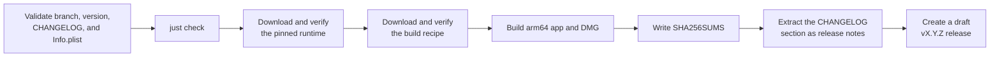

# Releases and updates

## User experience

Each release contains a complete Apple Silicon DMG with the launcher, Wine, DXMT, licenses, and an Applications shortcut. Arknights game files are never part of the DMG.

Wine and DXMT are released as one tested runtime unit. Do not combine arbitrary latest versions: the browser and graphics fixes must match the Wine build. The current runtime is Whisky `4.5.105-beta.1`, containing Wine 11.15, DXMT 0.80, GStreamer, and the Chromium child-window patches required by the game. A runtime change requires a game launch, web login, and exit test before release.

The launcher checks GitHub for a newer launcher version when it opens. If one exists, it links to the release page. Installation remains manual because the app is not Developer-ID signed or notarized. The check can be disabled in Settings.

The first check that discovers a new version shows a native popup containing the version and that GitHub Release's Markdown body. Dismissing it keeps the release button in the launcher's status capsule and the version in Settings. The same version is not presented as a popup again.

Game updates are checked separately against Yostar. The check can also be disabled. A check never downloads game data by itself; the user starts the update.

## Creating a release

Merge the release branch first, update the local `main` branch, and run `just release X.Y.Z` from clean, pushed `main`. Alternatively, start **Draft release** from the GitHub Actions page on `main` and enter the version there. Both paths require the same non-empty version section in `CHANGELOG.md` and an exact `CFBundleShortVersionString` match in `Resources/Info.plist`. The workflow also rejects other branches, malformed versions, and versions whose tag or release already exists.

Repository owners can inspect published DMG download counts with `just stats`. GitHub reports asset downloads rather than unique users or installations, so the derived totals and latest-version share are directional metrics only.



[`runtime.json`](../runtime.json) is the single source of truth for the tested runtime, its prefix revision, build recipe, component versions, source revisions, URLs, and checksums. The workflow reads it with `scripts/runtime_config.py`. Increase `prefixRevision` whenever a runtime or prefix configuration change must be applied to existing installations.

Release automation does not use repository variables for these values. A runtime update is a reviewed `runtime.json` change, so local and GitHub builds cannot silently select different binaries.

## Local packaging

The root [`runtime.json`](../runtime.json) file pins the prebuilt, tested runtime archive and its checksum. To download it and build the app, run:

```sh
just dev
```

`just runtime` downloads over HTTPS, verifies the SHA-256, safely extracts the archive, validates Wine and both DXMT architectures, and replaces `.build/runtime`. Repeated runs reuse the verified archive cache.

The Wine and DXMT binaries are prebuilt. Packaging compiles only the native Swift launcher and the small x86-64 compatibility components in `RuntimeSupport`, then changes Wine's staged menu shortcut from Option-Command-Q to the standard Command-Q. `just dev` produces the complete app and `just dev dmg` produces the installable disk image. Release users receive those finished artifacts and need no compiler or development tools.

Release automation always uses `runtime.json`. The attached `Runtime-Build-Recipe.tar.gz` records the runtime build process; it is not a complete corresponding-source bundle for every bundled runtime component.

Keep the release as a draft until the runtime notice and corresponding-source work described in [`legal/third-party-notices.md`](legal/third-party-notices.md) is complete. Then install its DMG on a clean Mac and test Install, Update, Repair, and Play before publishing. Published assets and version tags are never replaced. A broken release is fixed with a higher version.

## Versioning and changelog

Versions follow Semantic Versioning. Before 1.0, minor versions may contain deliberate compatibility changes; patch versions contain compatible fixes. User-visible work starts in `Unreleased` and moves into an `X.Y.Z` section before release.

## Signing limitation

The app is ad-hoc signed so its bundle is internally consistent, but it is not notarized. Users must confirm the first launch with right-click → **Open**. Developer ID and silent self-updates are intentionally outside the current plan.
